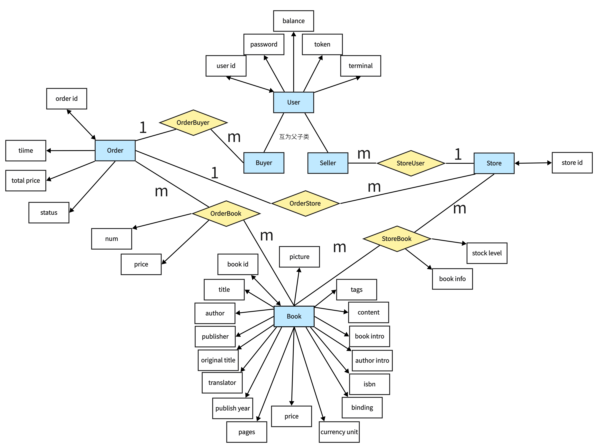
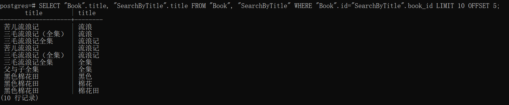
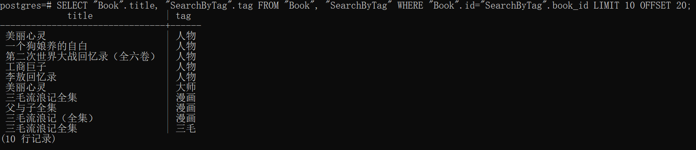
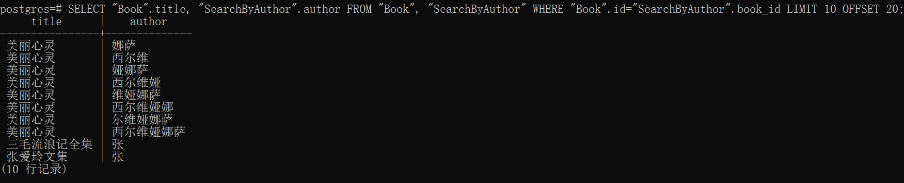
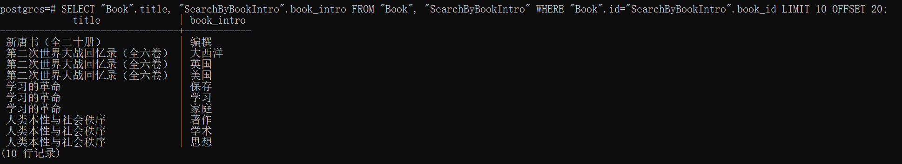

# 2022 CDMS PJ2: Bookstore

# 1. 需求分析

## (1) 主要功能

* 实现一个提供网上购书功能的网站后端。
* 网站支持书商在上面开商店，购买者可以通过网站购买。
* 买家和卖家都可以注册自己的账号。
* 一个卖家可以开一个或多个网上商店。
* 买家可以为自已的账户充值，在任意商店购买图书。
* 支持 下单->付款->发货->收货 流程。

## (2) 实体关系分析

总体来说，数据库应该包括以下几个基本的实体：用户、店铺、书本、订单。

### 用户

具体地，用户分为两个子类：买家和卖家。但是买家和卖家的界线是模糊的，因为一个用户可以同时是买家和卖家。因此两者在底层数据库中的表示没有区别，对应数据库`User`，只不过卖家存在与之关联的店铺。

### 店铺

店铺相当于卖家的一个属性，但是一个卖家可以有多家店铺，并且每家店铺拥有的图书以及库存都不相同。因此店铺更像是一个独立出来的对象，因此单独构建店铺数据库`Store`。同时通过关系`StoreUser`将卖家和店铺关联起来。

### 书本

书本更像是一个抽象的对象。所有店铺卖的书都在书本数据库`Book`中找得到，但是`Book`中的书本数据并不属于任何一个店铺，是抽象的书本，只是店铺可以拥有某些书本的库存。店铺和书本的对应库存关系存在关系`StoreBook`中。

### 订单

订单用于记录用户购买书本的记录。一个订单只能对应一个用户以及一个店铺，但是可以包含一个店铺内的多本书。因此订单需要通过外键和店铺、用户（买方）连接，同时还有一个一对多的，从`Order`到`Boook`的关系，因此需要一个额外的关系`OrderBoook`。

同时，订单对应5个状态：

* 未付款
* 已付款待发货
* 已发货
* 已签收
* 已取消

使用status属性来标记。

## (3) 数据库设计

根据**(2)**中实体和关系的分析，设计ER图如下：



([ER图链接](https://boardmix.cn/app/share?token=0LteA7GVg38Y3EJpJZ-r3xzSNRY83cgNVWwzEEdTbtW08Xfm0PGp5r-pzvswlK60BCiHsphciklQsRnygf_gXDRB3yOguuwAwiAGkQhOQnM=&inviteCode=pOYNh9))

其中蓝色的为实体，黄色的为关系。

### 关系表的省略

其中，关系**OrderBuyer**和**OrderStore**两个关系未建立数据表。因为通常访问**Order**时都会访问这两个属性，因此直接将其作为**Order**的属性了，通过外键和`User`和`Store`连接。

### Order.status

订单的status属性标记了订单的状态：

```txt
status:
    0: 待付款
    1: 待发货
    2: 已发货
    3: 已收货
   -1: 已取消
```


具体数据库层面的数据表设计，详见创建数据库代码[create_table.py](./bookstore/db_design/create_table.py)。上面展示的是基本功能层面的数据库设计。另外，还有为快速搜索构建的倒排索引表，将在后面的搜索部分介绍。

# 2. 前后端逻辑

前端主要分为4个页面：`auth`,`buyer`,`seller`,`search`。本节只介绍前三个页面。

## (1)auth

auth页面主要实现的是用户权限接口，包括注册、注销、登录、登出、修改密码五个功能。

### 注册register

从前端获得用户名和密码，调用myUser类，使用myUser类中的register函数。

后端实现逻辑：

* 生成终端terminal，根据user_id和terminal生成token
* 将该用户的id、password、balance、token、terminal插入到用户表

### 注销unregister

从前端获得用户名和密码，调用myUser类，使用myUser类中的unregister函数。
后端实现逻辑：

* 检查用户名和密码是否正确
* 若正确，从用户表删除该用户的信息

### 登录login

从前端获得用户名、密码和终端，调用myUser类，使用myUser类中的login函数
后端实现逻辑：

* 检查用户名和密码是否正确

* 检查用户是否存在

* 根据用户名和terminal编码成一个token，若用户存在，更新用户的token

### 登出logout

从前端获得用户名、token，调用myUser类，使用myUser类中的logout函数
后端实现逻辑：
* 检查token是否失效
* 检查用户是否存在

* 若存在，更新用户的terminal和token

### 修改密码change_password

从前端获得用户名、新密码和旧密码，调用myUser类，使用myUser类中的change_password函数
后端实现逻辑：
*  检查密码是否存在、是否正确
* 检查token是否失效
* 若密码正确且token没有失效，更新用户的password、terminal和token

## (2)buyer

buyer页面主要实现买家权限接口，包括6个功能：创建新的订单、付款、增加钱款、搜索订单、取消订单、收货。

### 创建新的订单(new_order)

前端：

* 获得用户名，店铺id和所需书的信息，书的信息又包括书的id和所需的数量

* 调用myBuyer类，使用myBuyer类中的new_order函数

后端：

* 判断用户名和店铺id是否存在。

* 如果存在，向Order表中插入一条订单数据，订单id根据用户名和店铺id唯一创建，订单状态设置为待付款，总价为0

* 遍历所需书的信息，判断每本书是否存在，库存是否足够

* 如果条件满足，库存会减少相应的数量，总价会相应更新

* 同时向`OrderBook`表中插入每本书的订单信息

* 创建订单成功，返回创建成功信息和订单号

### 付款（payment)  

前端：

* 获得用户名，订单id，密码

* 调用myBuyer类，使用myBuyer类中的payment函数

后端：

* 根据订单id查询相应订单信息

* 检查订单信息是否存在、传入的用户名与订单信息中用户名是否一致、从传入的密码与订单信息中密码是否一致、订单信息中的卖方信息是否存在、买方的余额是否足够、订单是否超时

* 以上条件满足，买方的余额扣除书的总价，而卖方的余额增加相应的总价，订单状态更新为已支付状态

* 付款成功，返回付款成功的信息

### 增加钱款（add_funds)

前端：

* 获得用户名，密码和要增加的钱款数目

* 调用myBuyer类，使用myBuyer类中的add_funds函数

后端：

* 根据用户名查找相应的用户

* 检查能否查找用户、用户密码和输入的是否不一致

* 如果满足以上条件，查找的用户余额会加上想要增加的钱款数

* 增加钱款成功，返回增加成功的信息

### 查找订单（search_orders)

前端：

* 获得用户名和密码

* 调用myBuyer类，使用myBuyer类中的search_orders函数

后端：

* 根据用户名查找相应的用户

* 检查是否可以查找到用户、用户密码和输入的是否不一致

* 如果满足以上条件，用户可以查找自己的所有订单

* 支付时间超过3天的订单会被取消

* 查找订单成功，返回查找成功的信息和所有的订单信息

### 取消订单（cancel_order)

前端：

* 获得用户名、密码和订单id

* 调用myBuyer类，使用myBuyer类中的cancel_order函数

后端:

* 根据用户名查找相应的用户。

* 检查用户是否存在、用户密码和输入的是否一致

* 根据订单id查找相应的订单信息

* 检查订单是否存在、订单是否待付款

* 如果以上的条件都满足，修改订单状态为已取消

* 订单取消成功，返回取消成功的信息

### 发货（take_delivery)

前端：
* 获得用户名、密码和订单号。
* 调用myBuyer类，使用myBuyer类中的take_delivery函数。

后端：
* 根据用户名查找相应的用户
* 检查用户是否存在、用户密码和输入的是否一致
* 根据订单id查找相应的订单信息
* 检查订单是否存在、订单是否已发货
* 如果以上的条件都满足，修改订单状态为已收货
* 订单收货成功，返回收货成功的信息

## (3)seller

seller页面主要实现卖家权限接口，包括4个功能：新增店铺中的书籍、增加书的库存、增开店铺、发货。

### 新增店铺中的书籍（add_book)

前端：
* 获得卖家用户名、店铺id。
* 调用mySeller类，使用mySeller 类中的add_book函数。

后端：
* 确认用户名、店铺id、书id是否存在
* 若条件满足，往StoreBook表中插入一条新增书的数据
* 插入成功，返回插入成功的信息。

### 增加书的库存（add_stock_level)

前端：
* 获得卖家的用户名、店铺id、书id、增加书的数量
* 调用mySeller类，使用mySeller 类中的add_stock_level函数。

后端：
* 判断用户名、店铺id、书id是否存在
* 根据书id和店铺id查找书的信息
* 判断满足条件的书是否存在
* 如果存在，增加相应的库存量
* 更新成功，返回更新成功的信息

### 增开店铺（create_store)

前端：
* 获得卖家的用户名、店铺id
* 调用mySeller类，使用mySeller 类中的create_store函数。

后端：
* 判断用户名、店铺id是否存在
* 根据书id和店铺id查找书的信息
* 向`Store`和`StoreUser`表中分别增加一条新增店铺的数据
* 插入成功，返回插入成功的信息

### 发货（deliver_goods)

前端：
* 获得订单id、店铺id
* 调用mySeller类，使用mySeller 类中的deliver_goods函数。

后端：
* 判断店铺id是否存在
* 根据店铺id查找订单的信息
* 判断订单信息是否存在，订单状态是否为待发货
* 如果满足以上条件，修改订单状态为已发货
* 修改成功，返回修改成功的信息

## (4) 订单超时自动取消的实现

订单支付超时的时限设为3天，超过3天未支付的订单直接取消。但是不可能对每笔订单单独使用一个线程去监测其时间。

考虑到需要得知订单有效性的只有两个时刻：支付时和搜索订单时。因此只考虑在这两个场景检查订单是否超时。若超时，前者返回“订单超时，支付失败”的错误，并取消订单，后者则将订单的状态修改为取消。

对于其他与订单交互的场景，只有创建订单和付款之后的流程。创建订单时必然不可能订单超时。而付款之后订单就生效了，因此也不会有超时未支付的问题。

## (5) 数据正确性

在高并发的场景，数据库的事务处理需要保证数据的正确性，尤其是涉及金融数据的场景。本次项目中所有对数据库的修改操作都使用ORM实现，通过会话`session`实现与数据库的通信。

* 在每一个任务中，我们都保证了`session`的即用即释放，也就是说用完session就将其及时关闭，减少不必要的空等时间。
* 每个任务提交之前（`session.commit()`），我们都保证所有任务修改都添加了。也就是说，对于一个多次提交修改的任务，必须所有修改都添加到会话之后，再一起提交。这样保证了事务处理的原子性，一个任务要么完成了，要么完全没有完成，不存在完成一半的情况。
* 若出现了错误，则回滚（`session.rollback()`）前面提交的修改。

```python
session = self.DbSession()
try:
    session.add(foo)
    ...
    if error1:
        session.close()
        return error_msg
    ...
    session.add(bar)
    session.commit()
    session.close()
except Error:
    session.rollback()
    return Error_msg
return ok
```

# 3. 搜索模块实现

## (1) 需求分析

需要实现图书搜索的功能。

首先，我们希望图书搜索的功能是所有人都能使用的，不需要注册，因为图书搜索只是一个检索信息的过程，并不写入数据。这样在商业层面也能带来更多的用户流量。

另外，我们提供两种搜索模式：**多条件搜索**和**精确条件搜索**。前者可以接收用户提供的多个条件，并返回同时满足这些条件的图书信息。但是该结果的产出可能会比较慢；后者可以接收用户对单个条件的搜索请求，并且快速返回结果。

## (2) 多条件搜索

多条件搜索的前端接口在`be/view/search.py`中的`/multiple`路由下。该搜索的实现分为以下几个步骤：

* 获取搜索参数组合。该接口先从post请求中得到对每个条件的搜索要求。对于未输入的条件，置为空。对于得到的所有参数，生成args字典，作为传入后端的参数。然后调用后端函数`search_multiple()`执行搜索任务。
* 后端函数获取传入的搜索参数后，对其进行解析。对于空的条件设为None，而对于非空条件，则生成对应的**filter**。**filter**内部对搜索条件的匹配使用`.like()`方法。
* 调用数据库session进行搜索，利用`and_`函数将所有**filter**整合起来，作为搜索的整体条件过滤器。然后返回结果。

可以看到，搜索主要是通过`.like()`实现的。对于小规模数据库，该方法简洁，易于实现。但是对于大规模数据库，`.like()`方法需要扫描整张表。若每有一个用户发起搜索请求都需要扫描全表，其代价是巨大的。因此我们考虑了下面的**精确条件搜索**模式。

## (3) 精确条件搜索

**精确条件搜索**目前实现了对四个图书参数的查询需求：标题、标签、作者、书本介绍。这也是用户查询需求最大的四个图书属性。

考虑对图书数据构建**全文索引**来加速搜索。大致构思如下：

* 用户输入的不一定是具体的属性内容，可能是一部分。
* 用户的输入是有逻辑可循的。比方说如果要搜索《三毛流浪记》，用户更有可能输入“三毛”、“流浪记”，而不会是“毛流”。
* 考虑对每种属性进行分词，相当于提取关键词。例如：《美丽心灵》进行分词后为“美丽”、“心灵”、“美丽心灵”。
* 将每个分词结果对应的书本id归为一条记录。这样通过分词就能检索到对应的书本了。

具体工作如下：

### a. 设计倒排索引表

首先构建四个属性对应的倒排索引表。根据前面的构思，需要构建四张表：

* `SearchByTitle`，记录title分词和book id的对应关系
* `SearchByTag`，记录tag分词和book id的对应关系
* `SearchByAuthor`，记录author分词和book id的对应关系
* `SearchByBookIntro`，记录book introduction分词和book id的对应关系

**提升分页效率的思考**

与此同时，考虑到分页的需求，对每张表都加入`rank`属性。

分页的需求可以使用`LIMIT page_size OFFSET pre_pages`来实现，但是这样会将前面的结果都扫描一遍，非常消耗时间。由于精确条件搜索的搜索参数只有一个，因此结果只会存在于一张表。`rank`参数就是对一张表内相同分词的每一行数据设置的一个“排名”。对于每次搜索，使用`BETWEEN a AND b`语句选择对应范围内`rank`的数据，从而用条件搜索来过滤得到当前页需要的数据，而不是获取全部数据之后再进行筛选。这对数据库吞吐耗时的提升是明显的。

在我们的项目中，这个排名暂时只是插入数据的顺序。在商业应用层面，其有广阔的延展空间。例如，可将其调整为书本的“搜索热度”。书本热度越高，书本在搜索结果中排名越靠前，也就越可能出现在前面的结果页中。

**联合索引的构建**

另外，对每张表的分词和`rank`构建联合索引。根据前面对`rank`的设计，这两者构成的联合体是唯一的，因此可以作为主键。同时，考虑到字段的先后顺序对联合索引的效率影响，考虑将联合索引的顺序定为**(分词, rank)**。

联合索引会遵循**最左前缀匹配**的原则，即最左优先，在检索数据时从联合索引的最左边开始匹配。而与`rank`比起来，分词的数量显然是更多的。更多时候通常是一个分词只对应一两个`rank`。因此将分词作为联合索引的左侧属性，检索出来的结果。这在B树上的检索效率会比调换顺序的联合索引要高。

具体倒排索引数据表设计，详见创建数据库代码[create_table.py](./bookstore/db_design/create_table.py)。

### b. 插入倒排索引数据

根据前面利用全文索引对搜索任务的设计，需要将**标题、标签、作者、书本介绍**四个属性进行分词处理。但每种属性有其特异性，其对应的分词处理也不尽相同。

* **标题**：标题考虑直接使用jieba分词工具`jieba.cut_for_search()`，这是搜素模式的分词，其分词的粒度更细，适用于当前应用场景。比如《美丽心灵》，分为“美丽”，“心灵”，“美丽心灵”。
* **标签**：标签本身就相当于分词的结果，因此将其具体标签的内容提取出来，就可以作为分词的结果。
* **作者**：作者名字无法做分词工作，用户搜索作者往往有两种模式：从前往后输入，比如想搜索高尔基，输入“高尔”；也有只记得名字的，比如想搜索周国平，却只记得其名“国平”。同时，数据中的作者还存在国籍信息，比如（美）查尔斯.霍顿.库利。国籍信息也可以作为作者搜索的选项。因此对作者的分词包括：国籍信息(若存在)，名字的所有前缀，名字的所有后缀。例如[美]唐德刚的分词结果就是：“美”，“唐”，“唐德”，“刚”，“德刚”，“唐德刚”。
* **书本介绍**：书本介绍往往是一段很长的文本，此时再使用jieba分词工具`jieba.cut_for_search()`会得到非常多的分词结果，但这些结果并不全是重要的。比如“《三毛流浪记》所描述的三毛所生活的那个时代......”该书本介绍中的重点是“三毛”，“时代”这些词，但是分词的结果会出现“描述”，“那个”，这些显然不是用户搜索时会考虑的。因此考虑对书本介绍进行关键词提取(使用`TextRank`算法，类似`PageRank`)，从长文本中提取少数的几个关键词，作为书本介绍的分词结果。这也相当于是给书本打标签。

在上面分词设计的基础上，插入分词-书本id数据，倒排索引表就建立好了。建表代码：[insert_search_data.py](./bookstore/db_design/insert_search_data.py)。

### c. 倒排索引表结果呈现

* **标题搜索表**

  

* **标签搜索表**

  

* **作者搜索表**

  

* **书本介绍搜索表**

  

## (4) 精确搜索模块前后端

搜索模块的前端接口在`be/view/search.py`中，包含以下接口：

### 全局搜索

全局搜索对应四个接口：

* 标题搜索，路由：`search/title`
* 标签搜索，路由：`search/tag`
* 作者搜索，路由：`search/author`
* 书本介绍搜索，路由：`search/book_intro`

全局搜索接口从post请求获取搜索参数和页数参数，传给后端，后端在对应的倒排索引表中搜索数据，使用`BETWEEN 10*(page-1) AND 10*page-1`筛选rank，然后返回所有结果。

### 店铺筛选搜索

考虑到用户可能会有在某个特定店铺搜索图书的需求，因此额外提供四个接口，用于特定店铺的精确图书搜索。

* 指定店铺标题搜索，路由：`search/title_store`
* 指定店铺标签搜索，路由：`search/tag_store`
* 指定店铺作者搜索，路由：`search/author_store`
* 指定店铺书本介绍搜索，路由：`search/book_intro_store`

店铺搜索接口从post请求获取搜索参数、店铺id和页数参数，传给后端。由于该搜索需要联合`StoreBook`表，因此`rank`参数没有其作用了，对分页的实现只能使用`LIMIT a OFFSET b`。得到结果后返回。

# 4. 接口测试

对于前端的接口测试，使用pytest进行接口测试。下面先介绍自己实现的几个接口。

## (1) 接口介绍

新实现的接口包括**搜索订单、取消订单、发货、收货、搜索书本**。

### a. 搜索订单

* **initialization：**初始化卖家、商店、买家，然后使用`GenBook`类给商店进货，然后给买家创建新的订单。
* **test_ok：**调用买家的`search_orders()`方法，该方法向`buyer/search_orders`路由发起post请求，传入用户名和密码，检测返回状态码。
* **test_authorization_error：**在test_ok的基础上对密码做修改，模拟非本人查询订单的操作。得到非正常的状态码。

### b. 取消订单

* **initialization：**初始化卖家、商店、买家，然后使用`GenBook`类给商店进货，然后给买家创建新的订单。
* **test_ok：**调用买家的`cancel_orders()`方法，该方法向`buyer/cancel_orders`路由发起post请求，传入用户名、密码和订单号，检测返回状态码。
* **test_authorization_error：**在test_ok的基础上对密码做修改，模拟非本人取消订单的操作。得到非正常的状态码。

### c. 发货

* **initialization：**初始化卖家、商店、买家，然后使用`GenBook`类给商店进货，然后给买家创建新的订单。然后给买家增加资金，并使其支付该订单。
* **test_ok：**调用卖家的`deliver_goods()`方法，该方法向`seller/deliver_goods`路由发起post请求，传入订单号和店铺号，检测返回状态码。
* **test_wrong_order_error：**在test_ok的基础上对order_id做修改，模拟本店铺对非本店的订单进行发货。得到错误的结果。
* **test_wrong_store_error：**在test_ok的基础上对store_id做修改，模拟其他店铺对本店的订单进行发货。得到错误的结果。
* **test_repeat_delivery：**执行两次相同的发货操作，第一次得到正确结果，第二次得到错误结果，因为一笔订单只能发货一次。

### d. 收货

* **initialization：**初始化卖家、商店、买家，然后使用`GenBook`类给商店进货，然后给买家创建新的订单。然后给买家增加资金，并使其支付该订单，然后卖家调用发货的方法。
* **test_ok：**调用买家的`take_delivery()`方法，该方法向`buyer/take_delivery`路由发起post请求，传入用户名、密码和订单号，检测返回状态码。
* **test_authorization_error：**在test_ok的基础上对密码做修改，模拟非本人确认收货的操作。得到非正常的状态码。
* **test_repeat_delivery：**一个用户不可能两次确认收货同一笔订单，买家调用收货方法两次，第一次得到正常状态码，第二次得到非正常状态码。

### e. 搜索书本

* **initialization：**初始化卖家、商店，然后使用`GenBook`类给商店进货。前面提到过，搜索功能不需要用户权限就可以使用，因此不初始化买家。
* **test_search_multiple：**测试多条件搜索，传入搜索参数args，调用`search_multiple`方法，先检测返回的状态码是否正常，再对返回的书本结果进行检测，具体地，检测结果是否满足搜索的条件，如：标题是否包含搜索字段，店铺名是否包含选择的店铺名字段。
* **test_search_by_title：**测试利用标题字段的精确搜索。传入标题字段，调用`search_by_title`方法，先检测返回的状态码是否正常，再对返回的书本结果进行检测。具体地，检测书本的标题是否包含该标题字段。
* **test_search_by_tag：**测试利用标签字段的精确搜索。传入标签字段，调用`search_by_tag`方法，先检测返回的状态码是否正常，再对返回的书本结果进行检测。具体地，检测书本的标签是否包含该标签字段。
* **test_search_by_author：**测试利用作者字段的精确搜索。传入作者字段，调用`search_by_author`方法，先检测返回的状态码是否正常，再对返回的书本结果进行检测。具体地，检测书本的作者是否包含该作者字段。
* **test_search_by_book_intro：**测试利用书本介绍字段的精确搜索。传入书本介绍字段，调用`search_by_book_intro`方法，先检测返回的状态码是否正常，再对返回的书本结果进行检测。具体地，检测书本的书本介绍是否包含该书本介绍字段。
* **test_search_by_title_store：**测试利用标题字段并指定书店的精确搜索。传入标题字段，调用`search_by_title_store`方法，先检测返回的状态码是否正常，再对返回的书本结果进行检测。具体地，检测书本的标题是否包含该标题字段。
* **test_search_by_tag_store：**测试利用标签字段并指定书店的精确搜索。传入标签字段，调用`search_by_tag_store`方法，先检测返回的状态码是否正常，再对返回的书本结果进行检测。具体地，检测书本的标签是否包含该标签字段。
* **test_search_by_author_store：**测试利用作者字段并指定书店的精确搜索。传入作者字段，调用`search_by_author_store`方法，先检测返回的状态码是否正常，再对返回的书本结果进行检测。具体地，检测书本的作者是否包含该作者字段。
* **test_search_by_book_intro_store：**测试利用书本介绍字段并指定书店的精确搜索。传入书本介绍字段，调用`search_by_book_intro_store`方法，先检测返回的状态码是否正常，再对返回的书本结果进行检测。具体地，检测书本的书本介绍是否包含该书本介绍字段。

## (2) 接口测试

使用pytest对接口进行测试，并计算代码覆盖率，结果储存在[index.html](./bookstore/htmlcov/index.html)中。

终端的测试结果如下：

```txt
============================= test session starts =============================
platform win32 -- Python 3.10.8, pytest-7.1.2, pluggy-1.0.0 -- D:\Anaconda\envs\db\python.exe
cachedir: .pytest_cache
rootdir: D:\onedrive\db\2022_CDMS_PJ2_REQUIRE\bookstore
collecting ... frontend begin test
collected 54 items

fe/test/test_add_book.py::TestAddBook::test_ok PASSED                    [  1%]
fe/test/test_add_book.py::TestAddBook::test_error_non_exist_store_id PASSED [  3%]
fe/test/test_add_book.py::TestAddBook::test_error_exist_book_id PASSED   [  5%]
fe/test/test_add_book.py::TestAddBook::test_error_non_exist_user_id PASSED [  7%]
fe/test/test_add_funds.py::TestAddFunds::test_ok PASSED                  [  9%]
fe/test/test_add_funds.py::TestAddFunds::test_error_user_id PASSED       [ 11%]
fe/test/test_add_funds.py::TestAddFunds::test_error_password PASSED      [ 12%]
fe/test/test_add_stock_level.py::TestAddStockLevel::test_error_user_id PASSED [ 14%]
fe/test/test_add_stock_level.py::TestAddStockLevel::test_error_store_id PASSED [ 16%]
fe/test/test_add_stock_level.py::TestAddStockLevel::test_error_book_id PASSED [ 18%]
fe/test/test_add_stock_level.py::TestAddStockLevel::test_ok PASSED       [ 20%]
fe/test/test_bench.py::test_bench PASSED                                 [ 22%]
fe/test/test_cancel_order.py::TestCancelOrder::test_ok PASSED            [ 24%]
fe/test/test_cancel_order.py::TestCancelOrder::test_authorization_error PASSED [ 25%]
fe/test/test_cancel_order.py::TestCancelOrder::test_repeat_cancel PASSED [ 27%]
fe/test/test_create_store.py::TestCreateStore::test_ok PASSED            [ 29%]
fe/test/test_create_store.py::TestCreateStore::test_error_exist_store_id PASSED [ 31%]
fe/test/test_deliver_goods.py::TestDeliverGoods::test_ok PASSED          [ 33%]
fe/test/test_deliver_goods.py::TestDeliverGoods::test_wrong_order_error PASSED [ 35%]
fe/test/test_deliver_goods.py::TestDeliverGoods::test_wrong_store_error PASSED [ 37%]
fe/test/test_deliver_goods.py::TestDeliverGoods::test_repeat_delivery PASSED [ 38%]
fe/test/test_login.py::TestLogin::test_ok PASSED                         [ 40%]
fe/test/test_login.py::TestLogin::test_error_user_id PASSED              [ 42%]
fe/test/test_login.py::TestLogin::test_error_password PASSED             [ 44%]
fe/test/test_new_order.py::TestNewOrder::test_non_exist_book_id PASSED   [ 46%]
fe/test/test_new_order.py::TestNewOrder::test_low_stock_level PASSED     [ 48%]
fe/test/test_new_order.py::TestNewOrder::test_ok PASSED                  [ 50%]
fe/test/test_new_order.py::TestNewOrder::test_non_exist_user_id PASSED   [ 51%]
fe/test/test_new_order.py::TestNewOrder::test_non_exist_store_id PASSED  [ 53%]
fe/test/test_password.py::TestPassword::test_ok PASSED                   [ 55%]
fe/test/test_password.py::TestPassword::test_error_password PASSED       [ 57%]
fe/test/test_password.py::TestPassword::test_error_user_id PASSED        [ 59%]
fe/test/test_payment.py::TestPayment::test_ok PASSED                     [ 61%]
fe/test/test_payment.py::TestPayment::test_authorization_error PASSED    [ 62%]
fe/test/test_payment.py::TestPayment::test_not_suff_funds PASSED         [ 64%]
fe/test/test_payment.py::TestPayment::test_repeat_pay PASSED             [ 66%]
fe/test/test_register.py::TestRegister::test_register_ok PASSED          [ 68%]
fe/test/test_register.py::TestRegister::test_unregister_ok PASSED        [ 70%]
fe/test/test_register.py::TestRegister::test_unregister_error_authorization PASSED [ 72%]
fe/test/test_register.py::TestRegister::test_register_error_exist_user_id PASSED [ 74%]
fe/test/test_search_books.py::TestLogin::test_search_multiple PASSED     [ 75%]
fe/test/test_search_books.py::TestLogin::test_search_by_title PASSED     [ 77%]
fe/test/test_search_books.py::TestLogin::test_search_by_tag PASSED       [ 79%]
fe/test/test_search_books.py::TestLogin::test_search_by_author PASSED    [ 81%]
fe/test/test_search_books.py::TestLogin::test_search_by_book_intro PASSED [ 83%]
fe/test/test_search_books.py::TestLogin::test_search_by_title_store PASSED [ 85%]
fe/test/test_search_books.py::TestLogin::test_search_by_tag_store PASSED [ 87%]
fe/test/test_search_books.py::TestLogin::test_search_by_author_store PASSED [ 88%]
fe/test/test_search_books.py::TestLogin::test_search_by_book_intro_store PASSED [ 90%]
fe/test/test_search_orders.py::TestSearchOrders::test_ok PASSED          [ 92%]
fe/test/test_search_orders.py::TestSearchOrders::test_authorization_error PASSED [ 94%]
fe/test/test_take_delivery.py::TestTakeDelivery::test_ok PASSED          [ 96%]
fe/test/test_take_delivery.py::TestTakeDelivery::test_authorization_error PASSED [ 98%]
fe/test/test_take_delivery.py::TestTakeDelivery::test_repeat_delivery PASSED [100%]D:\onedrive\db\2022_CDMS_PJ2_REQUIRE\bookstore\be\serve.py:17: UserWarning: The 'environ['werkzeug.server.shutdown']' function is deprecated and will be removed in Werkzeug 2.1.
  func()
2022-12-09 15:45:35,431 [Thread-4166 ] [INFO ]  127.0.0.1 - - [09/Dec/2022 15:45:35] "GET /shutdown HTTP/1.1" 200 -


======================= 54 passed in 174.03s (0:02:54) ========================
frontend end test
No data to combine
Name                              Stmts   Miss Branch BrPart  Cover
-------------------------------------------------------------------
be\__init__.py                        0      0      0      0   100%
be\app.py                             7      7      2      0     0%
be\model\__init__.py                  0      0      0      0   100%
be\model\buyer.py                   201     49     56     11    77%
be\model\db.py                      109      2     24      1    98%
be\model\error.py                    31      4      0      0    87%
be\model\search.py                  105     19     24      1    84%
be\model\seller.py                   84     13     26      2    86%
be\model\user.py                    141     21     30      5    85%
be\serve.py                          34      1      2      1    94%
be\view\__init__.py                   0      0      0      0   100%
be\view\auth.py                      42      0      0      0   100%
be\view\buyer.py                     57      0      2      0   100%
be\view\search.py                   100      8     16      8    86%
be\view\seller.py                    38      0      0      0   100%
fe\__init__.py                        0      0      0      0   100%
fe\access\__init__.py                 0      0      0      0   100%
fe\access\auth.py                    31      0      2      0   100%
fe\access\book.py                    71      1     16      2    97%
fe\access\buyer.py                   54      0      4      0   100%
fe\access\new_buyer.py                8      0      0      0   100%
fe\access\new_seller.py               8      0      0      0   100%
fe\access\search.py                  49      0      2      0   100%
fe\access\seller.py                  37      0      2      0   100%
fe\bench\__init__.py                  0      0      0      0   100%
fe\bench\run.py                      13      0      6      0   100%
fe\bench\session.py                  47      0     14      1    98%
fe\bench\workload.py                125      1     28      2    98%
fe\conf.py                           11      0      0      0   100%
fe\conftest.py                       17      0      0      0   100%
fe\test\gen_book_data.py             48      0     18      0   100%
fe\test\test_add_book.py             36      0     12      0   100%
fe\test\test_add_funds.py            23      0      2      0   100%
fe\test\test_add_stock_level.py      39      0     12      0   100%
fe\test\test_bench.py                 6      2      0      0    67%
fe\test\test_cancel_order.py         41      0      2      0   100%
fe\test\test_create_store.py         20      0      2      0   100%
fe\test\test_deliver_goods.py        62      1      6      1    97%
fe\test\test_login.py                28      0      2      0   100%
fe\test\test_new_order.py            40      0      2      0   100%
fe\test\test_password.py             33      0      2      0   100%
fe\test\test_payment.py              60      1      6      1    97%
fe\test\test_register.py             31      0      2      0   100%
fe\test\test_search_books.py         85      4     20      4    92%
fe\test\test_search_orders.py        43      0      2      0   100%
fe\test\test_take_delivery.py        60      1      6      1    97%
-------------------------------------------------------------------
TOTAL                              2075    135    352     41    93%
Wrote HTML report to htmlcov\index.html
```

所有接口测试都pass了，并且代码覆盖率达到了93%，未覆盖的基本都是一些错误处理的代码。对于这么一个体量的项目来说，该覆盖率已经算是相当高了。